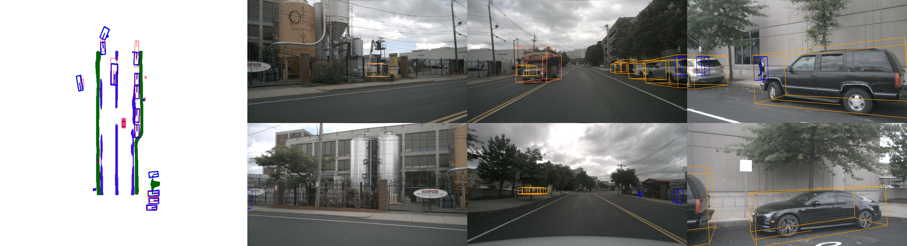
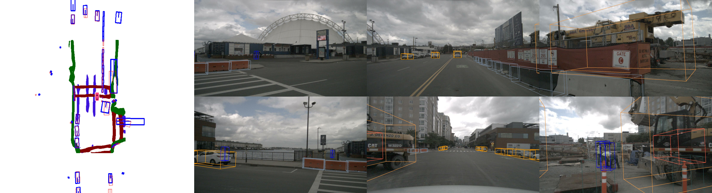

# Plugging BEVRestore into BEVFormer

This repository provides BEV segmentation code based on [BEVFormer](https://github.com/fundamentalvision/BEVFormer) and [BEVRestore](https://github.com/minshu-kim/BEVRestore).

https://user-images.githubusercontent.com/72087870/232678436-b0b51b1b-fe09-4ed1-aadd-be2589360276.mp4

# Abstract
In this work, the authors present a new framework termed BEVFormer, which learns unified BEV representations with spatiotemporal transformers to support multiple autonomous driving perception tasks. In a nutshell, BEVFormer exploits both spatial and temporal information by interacting with spatial and temporal space through predefined grid-shaped BEV queries. To aggregate spatial information, the authors design a spatial cross-attention that each BEV query extracts the spatial features from the regions of interest across camera views. For temporal information, the authors propose a temporal self-attention to recurrently fuse the history BEV information.
The proposed approach achieves the new state-of-the-art **56.9\%** in terms of NDS metric on the nuScenes test set, which is **9.0** points higher than previous best arts and on par with the performance of LiDAR-based baselines.

# Methods

# Getting Started
- [Installation](docs/install.md) 
- [Prepare Dataset](docs/prepare_dataset.md)
- [Run and Eval](docs/getting_started.md)

# Model

We measured training memory containing tensor cache and inference time latency with a single batch.

| model                      | BEVRestore | Latency | Memory   | mIoU       |weight |
| -------------------------- | :-------------: | :-------------: | :----------: | :----------: |---------- |
|   [BEVFomer-small](https://github.com/minshu-kim/BEVRest-BEVFormer-seg/blob/main/projects/configs/bevformer/bevformer_seg.py)  |           | 125        | 9.9GB      | 40.1     |[model](https://drive.google.com/file/d/1Fn9ErCrWheNFfnCK3EZ1VmCPceUTxS5G/view?usp=share_link)|
| [BEVFomer-small-BEVRestore](https://github.com/minshu-kim/BEVRest-BEVFormer-seg/blob/main/projects/configs/bevformer/bevformer_bevrestore_hr_bev.py) |     V      | 104         | 2.5GB     | 41.3     |[LR](https://drive.google.com/file/d/1tUYpqrN6qXYd9uqS2PVViXG7i2GAXpwN/view?usp=sharing) / [HR](https://drive.google.com/file/d/1pNBIRXZl1ZbhupdWAfTGngbOnV_4qIn7/view?usp=share_link)|

# Acknowledgement
This project refers a [third-party](https://github.com/Bin-ze/BEVFormer_segmentation_detection) implementation. We thank them for their solid implementation.
